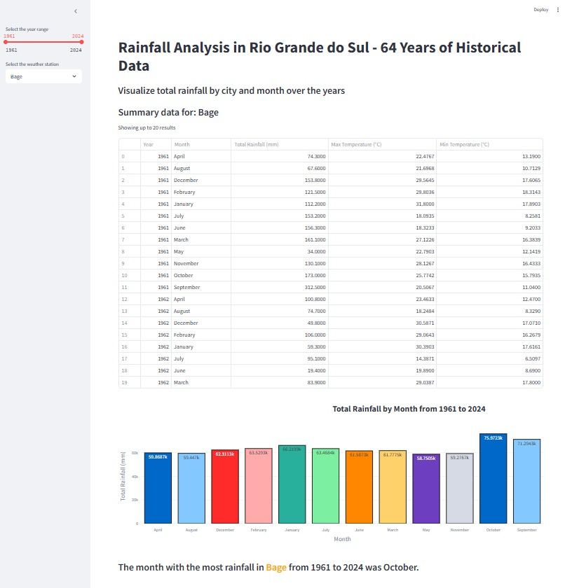

# 🌧️ Rainfall Analysis - Rio Grande do Sul (1961-2024)

This project is a simple data visualization web application built with **Python**, using **Pandas**, **Streamlit**, and **Plotly**.  
It allows interactive exploration of historical rainfall data from various weather stations in **Rio Grande do Sul**, covering **64 years** (1961 to 2024).

## 🚀 Technologies Used

- **Python**
- **Pandas** – For data manipulation and filtering
- **Streamlit** – For building the interactive web application
- **Plotly** – For generating interactive charts

## 📊 What This Project Does

- Filters rainfall data by:
  - Year range
  - Weather station
- Displays summarized tables with:
  - Total Rainfall
  - Average Max and Min Temperatures
- Highlights the **month with the most rainfall** within the selected period.
- Displays a **colorful bar chart** showing the distribution of total rainfall by month.

## 🖼️ Example

---

Feel free to clone, study, and improve this beginner-friendly project!
